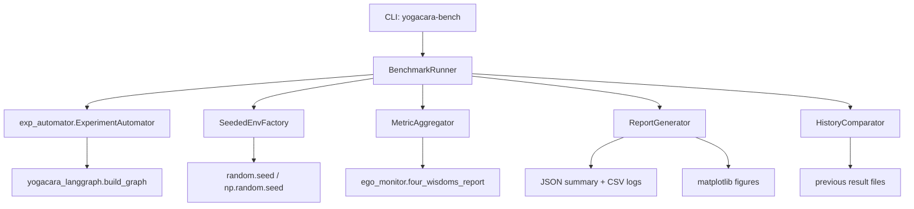

# 学术基准测试套件

Feature Name: academic-benchmark-suite
Updated: 2026-08-15

## Description

在现有 `exp_automator.py` 基础上构建标准化学术基准测试套件。新增命令行入口 `yogacara-bench`，支持多随机种子可复现实验、多维度指标报告、结果归档与历史对比，自动生成论文级图表。复用现有 LangGraph 图构建、置信区间计算与四智指标实现。

## Architecture



## Components and Interfaces

### 1. `src/yogacara_agent/benchmark_suite.py`（新增）

核心基准测试入口。

- `class BenchmarkConfig`（dataclass）:
  - `episodes: int = 30`
  - `max_steps: int = 60`
  - `seeds: list[int] | None = None`
  - `output_dir: str = "./experiments"`
  - `no_figures: bool = False`

- `class BenchmarkRunner`:
  - `__init__(config)`
  - `async run() -> BenchmarkResult`：执行所有种子组的实验。
  - `_run_seed_group(seed) -> pd.DataFrame`：单种子下多 episode 运行，返回 step 级日志。
  - `_compute_metrics(df) -> dict`：汇总性能/效率/认知指标。

- `class MetricAggregator`:
  - `aggregate(step_logs: list[pd.DataFrame]) -> dict`：计算跨 episode 均值、标准差、95% CI。
  - `_compute_wisdom()`：复用 `ego_monitor.four_wisdoms_report`。

- `class ReportGenerator`:
  - `to_json(summary) -> None`：写 `summary.json`。
  - `to_text(summary) -> str`：生成人类可读报告。
  - `generate_figures(df, seeds) -> list[str]`：生成学习曲线图与对比条形图。

- `class HistoryComparator`:
  - `compare(output_dir) -> dict | None`：读取历史 `summary.json`，生成对比表。

- `async def main(argv=None)`：CLI 入口。

### 2. `pyproject.toml`（修改）

新增 scripts 入口：

```toml
yogacara-bench = "yogacara_agent.benchmark_suite:main"
```

### 3. `src/yogacara_agent/exp_automator.py`（修改，轻量）

- `ExperimentAutomator` 增加可选 `seed: int | None = None` 参数，`run_all` 前调用 `_apply_seed(seed)`（`random.seed` + `np.random.seed`）。
- 暴露 `compute_ci(values)` 辅助函数供 BenchmarkRunner 复用。

## Data Models

### 性能指标（summary.json 结构）

```json
{
  "config": {"episodes": 30, "max_steps": 60, "seeds": [42], "output_dir": "./experiments"},
  "run_id": "20260815-153000-42",
  "metrics": {
    "cumulative_reward": {"mean": 8.42, "std": 1.2, "ci_lower": 7.98, "ci_upper": 8.86},
    "resource_found_rate": 0.65,
    "manas_intercept_rate": 0.12,
    "avg_steps": 58.3,
    "reward_per_step": 0.145
  },
  "wisdom": {"大圆镜智": 0.55, "平等性智": 0.71, "妙观察智": 0.68, "成所作智": 0.9},
  "seed_distribution": {"名言种": 10, "业种": 28, "异熟种": 4},
  "avg_seed_importance": 0.72,
  "timestamp": "2026-08-15T15:30:00",
  "seed_used": 42
}
```

### 结果文件布局

```
{output_dir}/
├── summary.json          # 本次实验摘要
├── summary.txt           # 人类可读报告
├── experiment_logs.csv   # step 级日志（复用现有格式）
├── step_stats.csv        # 按 step 聚合统计（复用现有格式）
├── fig1_reward_ci.pdf    # 学习曲线（95% CI）
├── fig1_reward_ci.png
└── fig2_seed_compare.png # 多种子对比条形图（有对比时）
```

## Correctness Properties

1. 相同 seed 配置 ⇒ 相同累计奖励序列（随机源已固定）。
2. CI 计算使用 `1.96 * std / sqrt(n)`，n = episode 数。
3. 报告 JSON 中所有数值为原生 float/int，可被其他工具无歧义解析。
4. 单 episode 异常不影响整批：异常 episode 记录 warning 并从统计中剔除（或计入失败数）。
5. 历史对比仅在存在 `summary.json` 时生成，否则明确标注"无历史对比"。
6. 缺失 matplotlib 时降级为纯文本报告，退出码 0。

## Error Handling

| 场景 | 处理策略 |
|------|---------|
| episodes < 1 或 max_steps < 1 | argparse 层报错退出（exit code 2） |
| 依赖缺失（matplotlib/pandas） | 输出降级文本报告，不中断 |
| 单 episode 运行时异常 | 捕获并记录 warning，计入失败计数 |
| 输出目录不可写 | 捕获 OSError 并给出清晰错误信息 |
| 历史结果损坏（JSON 解析失败） | 跳过对比表并标注"历史对比不可用" |

## Test Strategy

- `tests/test_benchmark_suite.py`（新增）：
  - `BenchmarkRunner` 小规模运行（episodes=2, max_steps=5）成功返回结果。
  - 相同 seed 两次运行累计奖励序列一致。
  - `MetricAggregator` CI 计算正确（与手工计算对比）。
  - `HistoryComparator` 无历史时返回 None；有历史时生成对比表。
  - 结果文件（summary.json/CSV）正确落盘。
  - `main(["--episodes", "1", "--max-steps", "3", "--output", "tmp", "--no-figures"])` CLI 冒烟测试。
- 复用 `tests/test_core.py` 现有 pytest 配置，不需新增依赖。

## References

[^1]: (Filename#L19) - exp_automator.parse_args 现有 CLI 参数
[^2]: (Filename#L77) - run_all 批量 episode 与置信区间实现
[^3]: (Filename#L224) - four_wisdoms_report 四智指标实现
