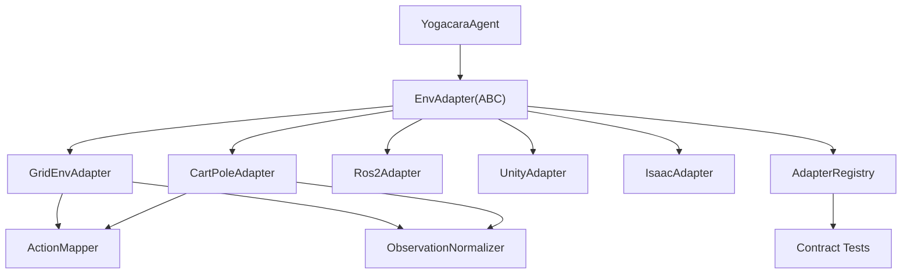

# 环境适配器扩展

Feature Name: env-adapter-extensions
Updated: 2026-08-15

## Description

扩展 `src/env_adapters/` 适配器体系。当前 `base.py` 仅有最小协议，ROS2/Unity/Isaac 三个适配器为占位实现。本特性建立标准化的 `EnvAdapter` 抽象基类、动作映射工具与观测规范化工具，实现一个可测试的栅格世界参考适配器，并为 CartPole 连续控制环境提供示例适配器。所有适配器通过统一契约测试验证。

## Architecture



## Components and Interfaces

### 1. `src/env_adapters/base.py`（重写）

`EnvAdapter` 抽象基类：

```python
class EnvAdapter(ABC):
    @abstractmethod
    def reset(self, seed: int | None = None) -> np.ndarray: ...
    @abstractmethod
    def step(self, action) -> tuple[np.ndarray, float, bool, dict]: ...
    @abstractmethod
    def get_observation_space(self) -> dict: ...  # {"shape": [...], "dtype": str, "low": [...], "high": [...]}
    @abstractmethod
    def get_action_space(self) -> dict: ...        # {"type": "discrete", "size": int, "actions": [...]}
```

新增 `AdapterRegistry`：

```python
class AdapterRegistry:
    def register(name: str, factory: Callable) -> None: ...
    def create(name: str, **kwargs) -> EnvAdapter: ...
    def available() -> list[str]: ...
```

### 2. `src/env_adapters/action_mapper.py`（新增）

- `DEFAULT_ACTIONS = ["UP", "DOWN", "LEFT", "RIGHT", "STAY"]`
- `class ActionMapper`:
  - `__init__(self, actions: list[str] | None = None, mapping: dict[str, int] | None = None)`
  - `to_index(action: str) -> int`
  - `to_action(index: int) -> str`
  - `validate()`：校验自定义映射覆盖全部 DEFAULT_ACTIONS。
  - 未知动作/越界索引抛 `ValueError`。

### 3. `src/env_adapters/observation_normalizer.py`（新增）

- `class ObservationNormalizer`:
  - `normalize_grid(grid_view) -> np.ndarray`：展平为一维 float32。
  - `normalize_continuous(values, mode="zscore"|"minmax", bounds=None) -> np.ndarray`
  - `metadata()` -> dict：shape/dtype/low/high。

### 4. `src/env_adapters/grid_env_adapter.py`（新增）

包装 `yogacara_test.GridSimEnv` 为 `EnvAdapter` 实现：

- `reset()` → 返回规范化网格观测（9 元视野 + 位置，维度可配置）。
- `step(action)` → 调用内部 `GridSimEnv.step`，返回四元组。
- 动作经 `ActionMapper` 校验。

### 5. `src/env_adapters/cartpole_adapter.py`（新增）

可选依赖（gym）示例适配器：

- 5 基础动作 → {UP/RIGHT: 推右, DOWN/LEFT: 推左, STAY: 保持上次} 映射。
- 4 维连续观测经 `ObservationNormalizer.normalize_continuous` 输出。
- gym 缺失时 `step`/`reset` 抛 `ImportError`，但 `get_*_space()` 仍可用（供注册/契约测试探测）。

### 6. `src/env_adapters/__init__.py`（修改）

导出 `EnvAdapter`、`ActionMapper`、`ObservationNormalizer`、`AdapterRegistry`；在 `__init__` 中注册内置适配器（grid、cartpole；ros2/unity/isaac 保留占位工厂）。

### 7. `src/env_adapters/ros2_adapter.py` 等（修改）

对齐新基类：占位实现改为继承 `EnvAdapter`，`reset`/`step` 抛 `NotImplementedError`，`get_*_space` 返回声明信息。可通过契约测试的结构校验（Requirement 5.4：不完整适配器标记失败而非中断）。

### 8. `tests/test_env_adapters.py`（新增）

契约测试驱动注册表中所有适配器。

## Data Models

### 观测空间元数据

```json
{
  "name": "grid",
  "shape": [11],
  "dtype": "float32",
  "low": [-1.0, ...],
  "high": [1.0, ...],
  "action_space": {"type": "discrete", "size": 5, "actions": ["UP", "DOWN", "LEFT", "RIGHT", "STAY"]}
}
```

### 契约测试结果

```json
{
  "adapter": "grid",
  "reset_ok": true,
  "step_ok": true,
  "obs_shape_ok": true,
  "obs_dtype_ok": true,
  "action_map_ok": true,
  "errors": []
}
```

## Correctness Properties

1. 所有 `EnvAdapter.step` 返回 `(obs, reward, done, info)` 四元组，`obs` 为 `np.ndarray`。
2. `ActionMapper` 对 5 个基础动作是双射（双向可逆），未知动作抛异常。
3. `ObservationNormalizer` 输出 dtype 恒为 `float32`，数值范围与声明一致。
4. 注册表幂等：同一名称重复注册覆盖前工厂，不产生重复条目。
5. 契约测试对单个适配器失败不阻断其他适配器执行（逐适配器 try/except）。
6. CartPole 缺 gym 时 `get_*_space()` 不抛异常，仅 `step`/`reset` 抛 `ImportError`。

## Error Handling

| 场景 | 处理策略 |
|------|---------|
| 未知动作 | ActionMapper 抛 ValueError（含合法动作列表） |
| 越界动作索引 | ActionMapper 抛 ValueError |
| 未注册适配器 | AdapterRegistry 抛 KeyError（含可用列表） |
| gym 缺失时调用 CartPole step/reset | 抛 ImportError，提示安装 gym |
| 占位适配器（ros2/unity/isaac）step/reset | 抛 NotImplementedError，注明对接文档 |
| 观测维度不符声明 | 契约测试标记该适配器失败并记录原因 |

## Test Strategy

- `tests/test_env_adapters.py`：
  - `ActionMapper`：双向映射、自定义映射校验、未知动作抛异常。
  - `ObservationNormalizer`：grid 展平、continuous 归一化、metadata。
  - `GridEnvAdapter`：完整契约测试通过（reset→step×N，四元组/形状/dtype）。
  - `CartPoleAdapter`：gym 可用时跑契约测试；不可用时验证 ImportError 与 space 探测。
  - `AdapterRegistry`：注册/创建/重复注册/未知名称。
  - 占位适配器：结构校验通过、step 抛 NotImplementedError。
- 回归：现有 `tests/test_core.py`（GridSimEnv 相关）不因包装改变行为。

## References

[^1]: (Filename#L1) - env_adapters/base.py 现有契约协议
[^2]: (Filename#L1) - ros2_adapter.py 现有占位实现
[^3]: (Filename#L62) - GridSimEnv.step 被包装的环境行为
