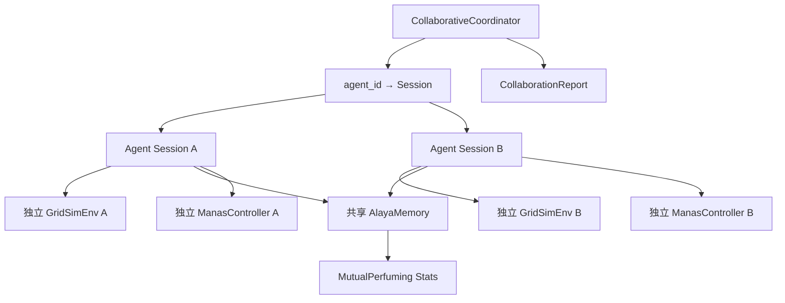

# 进程内多智能体协作模式

Feature Name: multi-agent-collaboration
Updated: 2026-08-15

## Description

为 Yogacara Agent 引入进程内多 Agent 协作能力。核心思路：**环境独立、记忆共享**。每个协作 Agent 拥有独立的 `GridSimEnv` 与决策状态，但共用同一个 `AlayaMemory` 种子库。种子在存储时携带来源 Agent ID，检索时返回共享种子并标注来源，实现互熏习（协作式进化）。提供协作实验入口与协作增益度量，支撑与单 Agent 基线的定量对比。

现状约束：`yogacara_langgraph.py` 使用模块级单例（`env`/`alaya`/`manas`），节点函数硬绑定这些单例，无法直接多实例化。本特性采用 **参数注入 + 工厂化** 方式改造，保持向后兼容（默认仍走模块级单例）。

## Architecture



## Components and Interfaces

### 1. `src/yogacara_agent/collaborative.py`（新增）

- `class CollaborativeCoordinator`:
  - `__init__(self, agent_count: int, seed: int | None = None, share_alaya: AlayaMemory | None = None)`
  - `create_agent(agent_id: str) -> dict`：创建独立 session（env/manas/state 独立，alaya 共享）。
  - `run_episode(agent_id: str, max_steps: int = 60) -> dict`：运行单个 Agent 的 episode。
  - `run_all(episodes_per_agent: int = 10, max_steps: int = 60) -> CollaborationReport`：交替运行各 Agent，共享种子库累积。
  - `collaboration_summary() -> dict`：按 Agent 分组的性能与种子贡献统计。
  - `release()`：清理会话。

- `class CollaborationReport`:
  - `per_agent: dict[str, AgentPerformance]`
  - `cross_agent_retrievals: int`
  - `seed_contribution: dict[str, int]`（按来源 Agent 的种子数）
  - `collaboration_gain: float | None`

- `def create_collaborative_session(agent_count, seed=None) -> CollaborativeCoordinator`

### 2. `src/yogacara_agent/yogacara_langgraph.py`（修改）

核心改造：节点函数从模块级单例改为**可选注入**。

- 新增 `create_isolated_session(agent_id: str) -> dict`：返回独立 env/manas/state，共享模块级 alaya（或传入的 alaya）。
- 节点函数增加可选参数 `ctx: dict | None = None`，`ctx` 携带 `{"env": ..., "manas": ..., "alaya": ..., "planner": ...}`；为 None 时回退模块级单例（保持向后兼容）。
- `node_store` 写入种子时，若 `ctx` 含 `agent_id`，在种子 dict 中增加 `"source_agent": agent_id` 元数据。
- `node_perceive` 检索种子后，将 `source_agent` 透传至 `state["retrieved_seed_sources"]`。

新增协作事件计数：

- 模块级 `_cross_agent_retrievals: int`（或挂到 alaya），当检索结果包含 `source_agent != 当前 agent_id` 的种子时自增。

### 3. `tests/`（新增）

- `tests/test_collaborative.py`：协作会话创建、互熏习、协作增益计算。

## Data Models

### 协作种子元数据

```json
{
  "state_emb": [0.1, 0.2, ...],
  "act": "UP",
  "rew": 5.0,
  "imp": 0.8,
  "align": 0.6,
  "tag": "依他起",
  "seed_type": "业种",
  "ts": 1755223200.0,
  "source_agent": "agent-0"
}
```

### CollaborationReport（summary.json 结构）

```json
{
  "config": {"agent_count": 4, "episodes_per_agent": 10, "max_steps": 60, "seed": 42},
  "per_agent": {
    "agent-0": {"cumulative_reward": 8.4, "manas_reflections": 3, "resources_found": 2, "cross_agent_seed_usage": 7}
  },
  "cross_agent_retrievals": 23,
  "seed_contribution": {"agent-0": 18, "agent-1": 22, "agent-2": 9, "agent-3": 15},
  "collaboration_gain": 0.18,
  "baseline_mean_reward": 7.1,
  "collaboration_mean_reward": 8.4
}
```

## Correctness Properties

1. 每个 Agent 的 `env.agent_pos`、`env.resources`、`state["step"]` 完全独立，互不读写对方实例。
2. 所有 Agent 共享唯一 `AlayaMemory` 实例，种子写入/检索串行化（复用现有 `_lock` 或新增协作锁）。
3. `source_agent` 仅在 `ctx` 提供 agent_id 时写入，单 Agent 模式下不引入该字段（向后兼容）。
4. 协作增益计算：`(collab_mean - baseline_mean) / baseline_mean`；`baseline_mean == 0` 时返回 `None`。
5. 跨 Agent 检索计数在种子含 `source_agent` 且与当前 agent 不同时自增，避免重复计数。
6. agent_count 上限保护：默认 ≤ 16，超出抛 ValueError。

## Error Handling

| 场景 | 处理策略 |
|------|---------|
| agent_count 非法（<2 或 >16） | 抛 ValueError 并说明合法范围 |
| 运行中某 Agent episode 异常 | 捕获并记录 warning，不影响其他 Agent |
| 协作种子检索无结果 | 返回空列表，Agent 按未知状态决策 |
| release 后继续调用 | 抛 RuntimeError 提示会话已关闭 |
| 基线实验失败 | collaboration_gain 置 None 并标注"基线不可用" |

## Test Strategy

- `tests/test_collaborative.py`：
  - 创建 3 个 Agent，验证 env 实例相互独立（位置互不影响）。
  - Agent A 运行后产生种子，Agent B 检索到带 `source_agent="agent-A"` 的种子。
  - 跨 Agent 检索计数正确。
  - 协作增益：构造已知基线/协作均值验证公式。
  - 向后兼容：不传 ctx 时节点函数行为与现有测试一致。
- 回归：现有 `tests/test_desktop_bridge.py`、`tests/test_langgraph.py` 必须通过（验证 ctx 缺省回退）。

## References

[^1]: (Filename#L236) - create_session 现有共享单例实现
[^2]: (Filename#L415) - node_store 种子写入点
[^3]: (Filename#L255) - node_perceive 种子检索点
