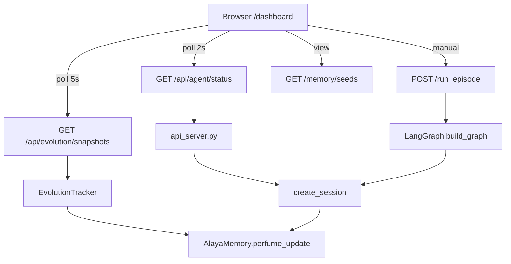

# Web 实时监控面板与种子演化可视化

Feature Name: web-monitoring-dashboard
Updated: 2026-08-15

## Description

在现有 FastAPI 服务上新增 `/dashboard` 静态页面与配套实时数据端点。页面采用原生 JS 实现，复用 desktop/index.html 的深色视觉风格，通过轮询方式实时展示八识运行状态、四智指标、末那拦截事件、种子库详情与种子演化时间线。

依赖现状：api_server.py 已提供 `/health`、`/memory/stats`、`/memory/seeds`、`/memory/perfume`、`/run_episode`、`/metrics/wisdom` 端点，且 slow_loop 每 10 秒运行一次 perfume_update。本特性在保留这些端点的基础上新增演化快照端点与页面。

## Architecture



## Components and Interfaces

### 1. `src/yogacara_agent/evolution_tracker.py`（新增）

进程内种子演化快照记录器，由 slow_loop 驱动。

- `class EvolutionTracker`:
  - `__init__(self, max_snapshots: int = 200)`
  - `snapshot(alaya) -> dict`：记录当前种子库状态（时间戳、种子总数、类型分布、平均重要性、平均对齐分），追加到 `self.snapshots`。
  - `get_snapshots(limit: int | None = None) -> list[dict]`：返回按时间升序的快照列表，超出 `max_snapshots` 时裁剪最旧记录。
  - `reset()`：清空快照。

数据模型（快照 dict）：

```json
{
  "ts": 1755223200.0,
  "total_seeds": 42,
  "seed_types": {"名言种": 10, "业种": 28, "异熟种": 4},
  "avg_importance": 0.72,
  "avg_alignment": 0.61
}
```

### 2. `src/yogacara_agent/api_server.py`（修改）

新增端点：

- `GET /api/agent/status`：聚合实时状态。返回 env 位置/步数、manas 拦截计数、四智指标（如可用）、种子总数。响应结构：

```json
{
  "agent_pos": [2, 3],
  "step": 37,
  "cumulative_reward": 8.4,
  "uncertainty": 0.42,
  "manas_reflections": 12,
  "resources_found": 2,
  "wisdom": {"大圆镜智": 0.55, "平等性智": 0.71, "妙观察智": 0.68, "成所作智": 0.9},
  "seed_count": 42,
  "updated_at": 1755223200.0
}
```

- `GET /api/evolution/snapshots?limit=100`：返回演化快照序列。
- `POST /api/evolution/snapshot`：手动触发一次快照（Requirement 3.6 的兜底机制）。

- `GET /dashboard`：返回 `desktop/dashboard.html`（通过 `FileResponse`）。

### 3. `desktop/dashboard.html`（新增）

独立监控页面。复用 desktop/index.html 的 CSS 变量与视觉风格，采用原生 JS + `fetch` 轮询。

- 状态徽章：运行中/已暂停/已完成/连接失败。
- 网格世界视图：10×10 渲染 Agent 位置、资源、陷阱、历史路径。
- 四智指标卡片：进度条 + 百分比。
- 末那拦截事件列表。
- 种子演化时间线：`<canvas>` 折线图，X 轴时间戳、Y 轴种子总数（主）与平均重要性（次）。
- 种子类型分布条形图（可选用 canvas 绘制）。
- 种子详情表：类型筛选 + 分页。
- 控制区：Episode 步数输入 + "运行 Episode" 按钮，结果展示。

## Data Models

### 演化快照（EvolutionSnapshot）

| 字段 | 类型 | 说明 |
|------|------|------|
| ts | float | 快照时间戳（epoch 秒） |
| total_seeds | int | 种子总数 |
| seed_types | dict[str, int] | 类型分布 |
| avg_importance | float | 平均重要性 [0,1] |
| avg_alignment | float | 平均对齐分 [0,1] |

### Agent 状态（AgentStatus）

| 字段 | 类型 | 说明 |
|------|------|------|
| agent_pos | list[int] | 当前 Agent 位置 |
| step | int | 当前步数 |
| cumulative_reward | float | 累计奖励 |
| uncertainty | float | 当前不确定性 |
| manas_reflections | int | 末那拦截总次数 |
| resources_found | int | 发现资源数 |
| wisdom | dict[str, float] | 四智指标快照 |
| seed_count | int | 种子总数 |
| updated_at | float | 数据时间戳 |

## Correctness Properties

1. 快照列表按 `ts` 升序排列，绝不倒序。
2. `snapshots` 长度恒 ≤ `max_snapshots`（200），写入前裁剪最旧。
3. 演化端点永不抛异常；空快照返回 `[]`。
4. `/api/agent/status` 在 env/alaya 状态读取时使用现有 `_episode_lock` 语义（只读快照，读取期间不持锁写）。
5. Dashboard 页面的 XSS 防护：所有动态文本使用 `textContent` 构建，禁用 `innerHTML` 注入（沿用 desktop/index.html 的 renderLogs 修复模式）。
6. 页面 `setInterval` 在 `visibilitychange` 隐藏时暂停轮询，避免后台空转。

## Error Handling

| 场景 | 处理策略 |
|------|---------|
| 后端不可达 | 页面状态徽章变红，显示"连接失败"，2s 后自动重试 |
| Episode 运行失败（5xx/4xx） | 展示错误详情，允许重试，按钮恢复可用 |
| 无演化快照数据 | 时间线区域显示"暂无演化数据，运行 Agent 以积累"空状态 |
| 快照超过 200 条 | 裁剪最旧记录，不影响新快照写入 |
| 四智指标未生成 | wisdom 字段返回空 dict，页面显示"待运行 Episode" |

## Test Strategy

- `tests/test_evolution_tracker.py`（新增）：
  - snapshot 后快照数 +1，字段完整。
  - 超过 max_snapshots 时裁剪最旧。
  - get_snapshots 按时间升序。
  - 空快照返回空数组。
- `tests/test_dashboard_api.py`（新增）：
  - `GET /api/agent/status` 返回预期字段。
  - `GET /api/evolution/snapshots` 空快照返回 `[]`。
  - `POST /api/evolution/snapshot` 手动触发成功。
  - `GET /dashboard` 返回 200 且内容含 `text/html`。
- `tests/test_dashboard_api.py` 使用 TestClient 且避免触发 lifespan slow_loop 副作用（通过 `TestClient(app)` 即可，slow_loop 为异步任务不阻塞测试）。

## References

[^1]: (Filename#L236) - create_session 返回共享 session 结构
[^2]: (Filename#L527) - slow_loop 每 10 秒执行 perfume_update
[^3]: (Filename#L224) - four_wisdoms_report 四智指标生成入口
