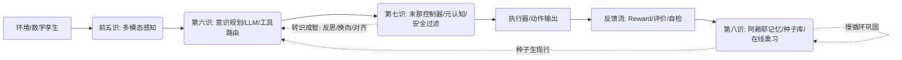

# 🌀 Yogacara Agent：基于唯识理论的进化型 AI Agent 框架
[](LICENSE)
[](https://www.python.org/)
[](https://langchain-ai.github.io/langgraph/)
[](https://github.com/YOUR_USERNAME/yogacara-agent/actions)

将佛教唯识学“八识”认知架构工程化为可计算、可演化、可对齐的 AI Agent 系统。支持快慢双循环决策、三性认知过滤、在线策略进化与跨仿真平台适配。

## 🏗️ 架构总览


## ✨ 核心特性
- 🧠 **八识计算映射**：感知→意识→末那调控→阿赖耶演化闭环
- ⚡ **快慢双循环**：毫秒级决策 + 异步记忆巩固/参数微调
- 🛡️ **三性判别机制**：遍计所执(幻觉过滤) / 依他起(因果追踪) / 圆成实(价值对齐)
- 🔌 **生产级底座**：LangGraph 状态机 / FastAPI / Ray Serve / vLLM / K8s+Helm
- 📊 **学术可验证**：在线实验流水线 / 95%置信区间 / 消融模板 / 一键出图
- 🌐 **跨域适配**：ROS2 / Unity ML-Agents / Isaac Sim 统一环境契约

## 🚀 快速开始
```bash
git clone https://github.com/YOUR_USERNAME/yogacara-agent.git
cd yogacara-agent
pip install -e ".[all]"
python src/yogacara_test.py  # MVP验证（零依赖）
```

## 📦 模块说明
| 模块 | 路径 | 功能 |
|------|------|------|
| MVP验证 | `src/yogacara_test.py` | 零依赖八识闭环跑通 |
| 生产编排 | `src/yogacara_langgraph.py` | 异步双循环+工具路由 |
| LLM接入 | `src/llm_planner.py` | Qwen/Llama结构化输出+降级 |
| 记忆持久化 | `src/milvus_memory.py` | HNSW索引/元数据过滤/批量熏习 |
| 在线对齐 | `src/online_alignment.py` | DPO+LoRA+EWC防遗忘 |
| 安全加固 | `src/security/` | 注入防御/沙箱/限流/记忆守卫 |
| 数字孪生 | `src/env_adapters/` | ROS2/Unity/Isaac统一接口 |
| 实验自动化 | `src/exp_automator.py` | 多轮并行/置信区间/论文图表 |
| 云原生部署 | `k8s/`, `helm/` | HPA扩缩容/ConfigMap热更/Ray拓扑 |

## 📖 详细文档
- [部署指南](docs/DEPLOYMENT.md)
- [安全规范](docs/SECURITY.md)
- [实验手册](docs/EXPERIMENTS.md)

## 🤝 贡献指南
详见 [CONTRIBUTING.md](CONTRIBUTING.md)

## 📜 许可证
Apache License 2.0。商业使用请保留版权声明。

## 📚 Citation
```bibtex
@software{yogacara_agent_2024,
  title = {Yogacara Agent: A Cognitive Evolution Framework for AI Agents},
  author = {Your Name},
  year = {2024},
  url = {https://github.com/YOUR_USERNAME/yogacara-agent},
  license = {Apache-2.0}
}
```
